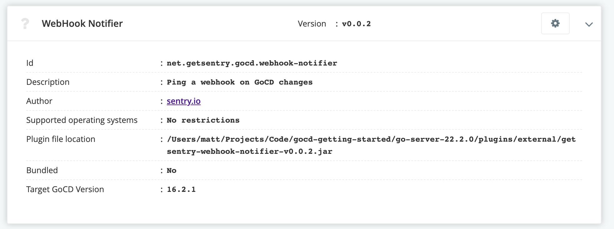
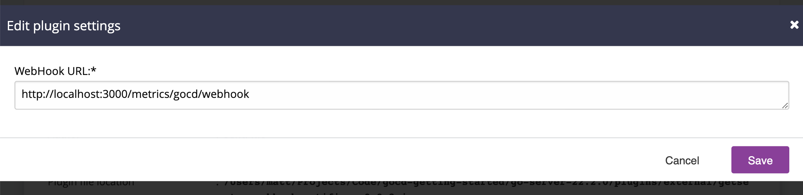

# WebHook Notification

Ping a webhook with status updates from GoCD.

## Usage

Place the release jar file into the `plugins/external/` directory.

Start the server and add your webhooks by going to `Admin > Plugins` and
clicking the cog for `WebHook Notifier`.

From there you can enter one or more webhooks seperated by new lines.

## Development

### Building the code base

To build the jar, run `gradle clean assemble`

### Tests

`gradle clean test`

### Release

Run the create release action.
